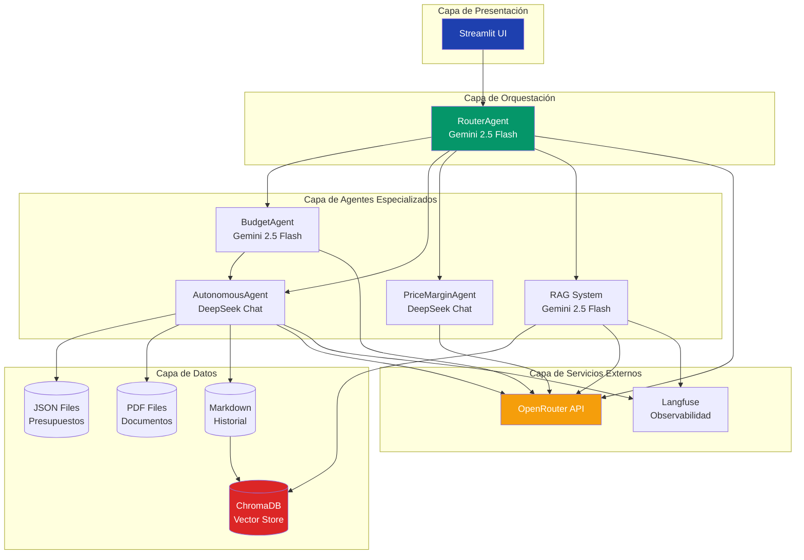

# Documentación Técnica: Sistema de Asistente Empresarial con PLN

## Proyecto: Entre Brochas - Asistente Inteligente para Gestión Empresarial

**Autor:** Francisco Doblado Díaz  
**Fecha:** 04/12/2025  
**Tecnologías:** Python, LangChain, Streamlit, RAG, OpenRouter API

---

## 📋 Índice

1. [Uso del Procesamiento del Lenguaje Natural](#uso-del-pln)
2. [Justificación y Utilidad](#justificación)
3. [Diagrama Conversacional](#diagrama)
4. [Detalles Técnicos](#detalles-técnicos)
5. [Arquitectura del Sistema](#arquitectura)
6. [Casos de Uso](#casos-de-uso)

---

## 1. Uso del Procesamiento del Lenguaje Natural {#uso-del-pln}

Este proyecto hace uso extensivo del **Procesamiento del Lenguaje Natural (PLN)** en múltiples niveles:

### 1.1. Comprensión de Intenciones del Usuario

El sistema utiliza PLN para:
- **Interpretar solicitudes en lenguaje natural**: Los usuarios pueden escribir peticiones como "necesito un presupuesto para pintar 100m²" sin necesidad de seguir un formato específico
- **Clasificar automáticamente la intención**: Mediante un agente router que determina si el usuario quiere:
  - Crear un presupuesto
  - Consultar historial
  - Analizar márgenes
  - Aceptar presupuestos
  - Marcar facturas como pagadas

### 1.2. Extracción de Información

El PLN permite extraer datos estructurados de conversaciones naturales:
- **Datos del cliente**: Nombre, NIF, dirección, email
- **Detalles del trabajo**: Área en m², tipo de pintura, tipo de trabajo
- **Normalización**: Manejo de tildes, mayúsculas/minúsculas, sinónimos

### 1.3. Generación de Respuestas Contextuales

Los modelos de lenguaje generan:
- **Respuestas coherentes y profesionales**
- **Preguntas de seguimiento** cuando falta información
- **Explicaciones detalladas** de cálculos y presupuestos
- **Confirmaciones y validaciones** de acciones realizadas

### 1.4. Búsqueda Semántica (RAG)

El sistema implementa **Retrieval-Augmented Generation (RAG)** que:
- Vectoriza documentos usando **embeddings semánticos**
- Busca información relevante por significado, no por palabras clave
- Recupera contexto histórico de clientes
- Genera respuestas basadas en datos reales del negocio

### 1.5. Conversación Multi-turno

El PLN mantiene:
- **Contexto conversacional**: Recuerda información de mensajes anteriores
- **Flujos conversacionales complejos**: Recopilación progresiva de datos
- **Manejo de ambigüedades**: Solicita aclaraciones cuando es necesario

---

## 2. Justificación y Utilidad {#justificación}

### ¿Por qué es útil usar PLN en este proyecto?

#### 2.1. **Interfaces Naturales e Intuitivas**
- ❌ **Sin PLN**: El usuario tendría que rellenar formularios rígidos, seleccionar opciones de menús
- ✅ **Con PLN**: El usuario escribe naturalmente como si hablara con un empleado

**Ejemplo comparativo:**

```
Sin PLN (formulario tradicional):
┌─────────────────────────────┐
│ Nombre: [________]          │
│ NIF: [________]             │
│ Dirección: [________]       │
│ Área (m²): [___]            │
│ Tipo pintura: [▼]           │
│   - Plástica                │
│   - Acrílica                │
│   - Esmalte                 │
└─────────────────────────────┘

Con PLN:
Usuario: "Necesito presupuesto para Juan García, 
         100m² de fachada con pintura plástica"
Asistente: "Perfecto! ¿Me proporcionas el NIF 
            y la dirección?"
```

#### 2.2. **Reducción de Tiempo y Errores**
- **Velocidad**: Una conversación fluida es más rápida que navegar por menús
- **Precisión**: El PLN valida y normaliza datos automáticamente
- **Flexibilidad**: Acepta múltiples formas de expresar la misma información

#### 2.3. **Accesibilidad**
- No requiere conocimientos técnicos
- Funciona en lenguaje cotidiano español
- Adaptable a diferentes estilos de comunicación

#### 2.4. **Automatización Inteligente**
El PLN permite:
- **Decisiones autónomas**: El sistema determina qué hacer sin intervención
- **Procesamiento contextual**: Entiende referencias a trabajos anteriores
- **Generación automática**: Crea documentos profesionales (PDFs) a partir de conversaciones

#### 2.5. **Experiencia de Usuario Superior**
- **Conversacional**: Se siente como hablar con un asistente humano
- **Eficiente**: Múltiples tareas en una sola conversación
- **Inteligente**: Aprende del histórico y ofrece información relevante

---

## 3. Diagrama Conversacional {#diagrama}


### 3.1. Flujo Principal de Conversación


### 3.2. Flujo de Creación de Presupuesto (Detallado)


### 3.3. Flujo RAG (Búsqueda Semántica)


---

## 4. Detalles Técnicos {#detalles-técnicos}

### 4.1. Modelos de Lenguaje Utilizados

El proyecto utiliza **2 modelos LLM diferentes** a través de **OpenRouter API**:

#### Modelo 1: Google Gemini 2.5 Flash (Principal)
```python
MODEL_NAME = "google/gemini-2.5-flash"
TEMPERATURE = 0.7
```

**Características:**
- **Velocidad**: Muy rápido (< 2s respuesta típica)
- **Costo**: ~$0.10 por 1M tokens entrada
- **Contexto**: 1M tokens
- **Capacidades**: Multimodal, razonamiento, seguimiento de instrucciones

**Uso en el proyecto:**
- RouterAgent (clasificación de intenciones)
- RAG System (generación de respuestas con contexto)
- BudgetAgent (conversación y recopilación de datos)
- Conversaciones generales

#### Modelo 2: DeepSeek Chat (Cálculos Precisos)
```python
MODEL_NAME = "deepseek/deepseek-chat"
TEMPERATURE = 0.2
```

**Características:**
- **Precisión**: Excelente para cálculos numéricos
- **Determinismo**: Temperature baja (0.2)
- **Costo**: ~$0.14 por 1M tokens entrada
- **Especialización**: Razonamiento lógico y matemático

**Uso en el proyecto:**
- PriceMarginAgent (análisis de márgenes)
- AutonomousAgent (cálculos de presupuestos)
- Invoice Generator (generación de facturas)

### 4.2. Framework: LangChain

```python
from langchain.agents import AgentExecutor, create_openai_functions_agent
from langchain.chains import RetrievalQA
from langchain.prompts import ChatPromptTemplate
from langchain_openai import ChatOpenAI
from langchain_community.vectorstores import Chroma
```

**LangChain proporciona:**
- Abstracción sobre diferentes LLMs
- Chains predefinidas (RetrievalQA)
- Gestión de prompts y templates
- Agentes con herramientas (@tool)
- Manejo de historial conversacional

### 4.3. Sistema RAG

#### Vector Store: ChromaDB
```python
from langchain_community.vectorstores import Chroma
from langchain_community.embeddings import HuggingFaceEmbeddings

embeddings = HuggingFaceEmbeddings(
    model_name="sentence-transformers/paraphrase-multilingual-mpnet-base-v2"
)

vectorstore = Chroma(
    collection_name="customer_history",
    embedding_function=embeddings,
    persist_directory="./chroma_db"
)
```

**Características:**
- **Embeddings**: Modelo multilingüe (español/inglés)
- **Dimensionalidad**: 768 dimensiones
- **Persistencia**: Base de datos local
- **Búsqueda**: Similitud coseno

#### Retriever
```python
retriever = vectorstore.as_retriever(
    search_type="similarity",
    search_kwargs={"k": 8}
)
```

### 4.4. Arquitectura de Agentes

#### 1. RouterAgent
```python
class RouterAgent:
    def __init__(self):
        self.llm = get_llm(temperature=0)  # Gemini 2.5 Flash
        
    def route(self, user_input: str) -> str:
        # Clasifica en: presupuesto, historial, márgenes, etc.
        return self.chain.invoke({"user_input": user_input})
```

**Categorías:**
- `presupuesto`: Crear presupuesto
- `historial`: Consultar datos pasados
- `margenes`: Análisis de precios
- `aceptar_presupuesto`: Generar factura
- `marcar_pagada`: Actualizar estado pago
- `general`: Conversación general

#### 2. BudgetCalculatorAgent
```python
class BudgetCalculatorAgent:
    def __init__(self):
        self.llm = get_llm(temperature=0.2)  # Gemini 2.5 Flash
        
    def generate_budget(self, user_input: str, chat_history=None):
        # Conversación para recopilar datos
        # Genera JSON cuando tiene toda la información
```

**Datos recopilados:**
- `cliente_nombre`
- `cliente_nif`
- `cliente_direccion`
- `area_m2`
- `tipo_pintura`
- `tipo_trabajo`

#### 3. AutonomousPresupuestoAgent
```python
class AutonomousPresupuestoAgent:
    def __init__(self):
        self.llm = ChatOpenAI(model="deepseek/deepseek-chat")
        self.tools = [
            calcular_presupuesto,
            generar_pdf_presupuesto,
            generar_pdf_factura,
            guardar_en_historial_cliente
        ]
```

**Herramientas (@tool):**
- ✅ Ejecuta acciones sin intervención humana
- ✅ Decide qué herramienta usar y cuándo
- ✅ Coordina múltiples acciones en secuencia

#### 4. CustomerHistoryRAG
```python
class CustomerHistoryRAG:
    def query(self, question: str):
        # Búsqueda semántica
        # RetrievalQA con prompt personalizado
        return {
            "answer": respuesta,
            "source_documents": documentos
        }
```

### 4.5. Stack Tecnológico Completo

```
Frontend:
├── Streamlit 1.28.0
└── CSS personalizado

Backend:
├── Python 3.10+
├── LangChain 0.1.0
├── LangChain-OpenAI
└── LangChain-Community

APIs:
├── OpenRouter API (acceso a LLMs)
└── Langfuse (observabilidad)

LLMs:
├── Google Gemini 2.5 Flash
└── DeepSeek Chat

RAG:
├── ChromaDB (vector store)
├── HuggingFace Embeddings
└── Sentence Transformers

Generación PDFs:
├── xhtml2pdf
├── Jinja2
└── ReportLab

Utilidades:
├── python-dotenv (variables entorno)
└── unicodedata (normalización texto)
```

### 4.6. Variables de Entorno

```bash
# .env
OPENROUTER_API_KEY=sk-or-v1-xxxxx
LANGFUSE_PUBLIC_KEY=pk-lf-xxxxx
LANGFUSE_SECRET_KEY=sk-lf-xxxxx
LANGFUSE_HOST=https://cloud.langfuse.com
```

### 4.7. Procesamiento de Texto

#### Normalización
```python
import unicodedata

def normalize_text(text):
    # Eliminar tildes
    normalized = ''.join(
        c for c in unicodedata.normalize('NFD', text)
        if unicodedata.category(c) != 'Mn'
    )
    return normalized.lower()
```

#### Extracción de Patrones
```python
import re

# Extraer número de presupuesto
match = re.search(r'PRES-\d{14}', text)

# Extraer JSON de respuesta
json_match = re.search(r'\{.*\}', response, re.DOTALL)
```

---

## 5. Arquitectura del Sistema {#arquitectura}



---

## 6. Casos de Uso {#casos-de-uso}

### Caso de Uso 1: Creación de Presupuesto

**Actor:** Empleado de "Entre Brochas"  
**PLN utilizado:** Comprensión de intenciones, extracción de entidades, conversación multi-turno

**Flujo:**
1. Usuario: "Necesito presupuesto para María López"
2. **PLN**: RouterAgent clasifica como "presupuesto"
3. **PLN**: BudgetAgent inicia conversación estructurada
4. **PLN**: Extrae y valida datos progresivamente
5. **PLN**: Genera JSON estructurado
6. Sistema calcula y genera PDF automáticamente

**Beneficio del PLN:** Sin PLN, el usuario tendría que rellenar un formulario rígido.

### Caso de Uso 2: Consulta de Historial

**Actor:** Empleado buscando información de cliente  
**PLN utilizado:** RAG, búsqueda semántica, embeddings

**Flujo:**
1. Usuario: "¿Qué le hicimos a Fredy la última vez?"
2. **PLN**: Router clasifica como "historial"
3. **PLN**: Embedding del query
4. **PLN**: Búsqueda vectorial semántica
5. **PLN**: LLM genera respuesta con contexto recuperado

**Beneficio del PLN:** Búsqueda por significado, no por palabras exactas. Entiende "la última vez", "le hicimos", etc.

### Caso de Uso 3: Análisis de Márgenes

**Actor:** Gerente analizando rentabilidad  
**PLN utilizado:** Razonamiento numérico, análisis contextual

**Flujo:**
1. Usuario: "¿Es rentable pintar 300m² con margen del 25%?"
2. **PLN**: Extrae cantidades y porcentajes
3. **PLN**: Analiza contexto histórico
4. **PLN**: Genera análisis detallado

**Beneficio del PLN:** Comprende preguntas abiertas y genera análisis personalizado.

---


### Link hacia el vídeo de demostración

https://youtu.be/hSiv7kci-HY

### Link hacia las trazas de langfuse

https://cloud.langfuse.com/project/cmiqbe7r8002bad07w9ce2qsw/traces/a9b452f8f21a08925643ff6363d8b2fd?timestamp=2025-12-10T15:54:59.691Z

https://cloud.langfuse.com/project/cmiqbe7r8002bad07w9ce2qsw/traces/7a30102ab44de54f001cd26cbbba2057?timestamp=2025-12-10T15:54:35.586Z
