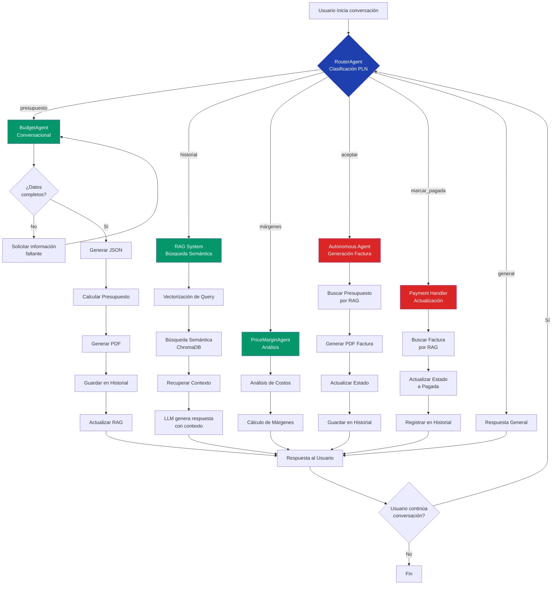
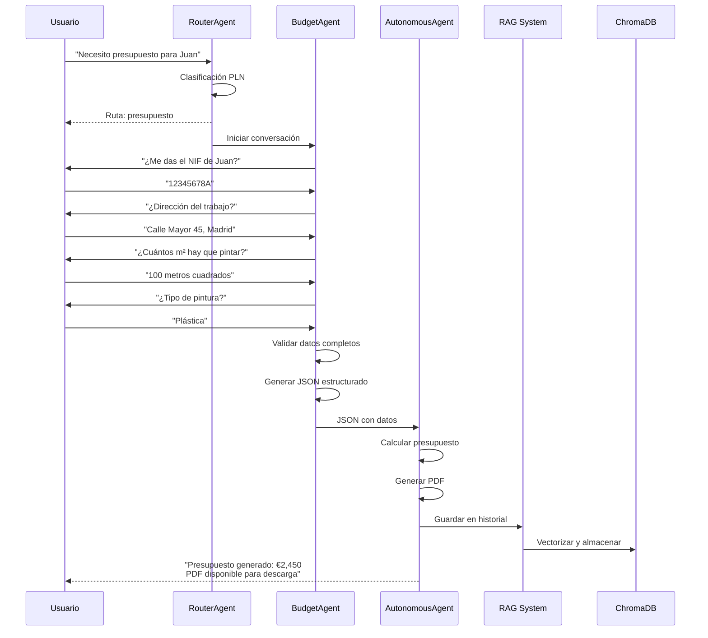
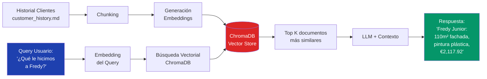

### 3.1. Flujo Principal de Conversación

```mermaid
graph TD
    A[Usuario inicia conversación] --> B{RouterAgent<br/>Clasificación PLN}
    
    B -->|presupuesto| C[BudgetAgent<br/>Conversacional]
    B -->|historial| D[RAG System<br/>Búsqueda Semántica]
    B -->|márgenes| E[PriceMarginAgent<br/>Análisis]
    B -->|aceptar| F[Autonomous Agent<br/>Generación Factura]
    B -->|marcar_pagada| G[Payment Handler<br/>Actualización]
    B -->|general| H[Respuesta General]
    
    C --> C1{¿Datos<br/>completos?}
    C1 -->|No| C2[Solicitar información<br/>faltante]
    C2 --> C
    C1 -->|Sí| C3[Generar JSON]
    C3 --> C4[Calcular Presupuesto]
    C4 --> C5[Generar PDF]
    C5 --> C6[Guardar en Historial]
    C6 --> C7[Actualizar RAG]
    C7 --> I[Respuesta al Usuario]
    
    D --> D1[Vectorización de Query]
    D1 --> D2[Búsqueda Semántica<br/>ChromaDB]
    D2 --> D3[Recuperar Contexto]
    D3 --> D4[LLM genera respuesta<br/>con contexto]
    D4 --> I
    
    E --> E1[Análisis de Costos]
    E1 --> E2[Cálculo de Márgenes]
    E2 --> I
    
    F --> F1[Buscar Presupuesto<br/>por RAG]
    F1 --> F2[Generar PDF Factura]
    F2 --> F3[Actualizar Estado]
    F3 --> F4[Guardar en Historial]
    F4 --> I
    
    G --> G1[Buscar Factura<br/>por RAG]
    G1 --> G2[Actualizar Estado<br/>a Pagada]
    G2 --> G3[Registrar en Historial]
    G3 --> I
    
    H --> I
    
    I --> J{Usuario continúa<br/>conversación?}
    J -->|Sí| B
    J -->|No| K[Fin]
    
    style B fill:#1e40af,color:#fff
    style C fill:#059669,color:#fff
    style D fill:#059669,color:#fff
    style E fill:#059669,color:#fff
    style F fill:#dc2626,color:#fff
    style G fill:#dc2626,color:#fff
```

### 3.2. Flujo de Creación de Presupuesto (Detallado)

```mermaid
sequenceDiagram
    participant U as Usuario
    participant R as RouterAgent
    participant B as BudgetAgent
    participant A as AutonomousAgent
    participant RAG as RAG System
    participant DB as ChromaDB
    
    U->>R: "Necesito presupuesto para Juan"
    R->>R: Clasificación PLN
    R-->>U: Ruta: presupuesto
    
    R->>B: Iniciar conversación
    B->>U: "¿Me das el NIF de Juan?"
    U->>B: "12345678A"
    
    B->>U: "¿Dirección del trabajo?"
    U->>B: "Calle Mayor 45, Madrid"
    
    B->>U: "¿Cuántos m² hay que pintar?"
    U->>B: "100 metros cuadrados"
    
    B->>U: "¿Tipo de pintura?"
    U->>B: "Plástica"
    
    B->>B: Validar datos completos
    B->>B: Generar JSON estructurado
    
    B->>A: JSON con datos
    A->>A: Calcular presupuesto
    A->>A: Generar PDF
    A->>RAG: Guardar en historial
    RAG->>DB: Vectorizar y almacenar
    
    A-->>U: "Presupuesto generado: €2,450<br/>PDF disponible para descarga"
```

### 3.3. Flujo RAG (Búsqueda Semántica)

```mermaid
graph LR
    A[Query Usuario:<br/>'¿Qué le hicimos<br/>a Fredy?'] --> B[Embedding<br/>del Query]
    B --> C[Búsqueda Vectorial<br/>ChromaDB]
    
    D[Historial Clientes<br/>customer_history.md] --> E[Chunking]
    E --> F[Generación<br/>Embeddings]
    F --> G[(ChromaDB<br/>Vector Store)]
    
    C --> G
    G --> H[Top K documentos<br/>más similares]
    H --> I[LLM + Contexto]
    I --> J[Respuesta:<br/>'Fredy Junior:<br/>110m² fachada,<br/>pintura plástica,<br/>€2,117.92']
    
    style A fill:#1e40af,color:#fff
    style J fill:#059669,color:#fff
    style G fill:#dc2626,color:#fff
```